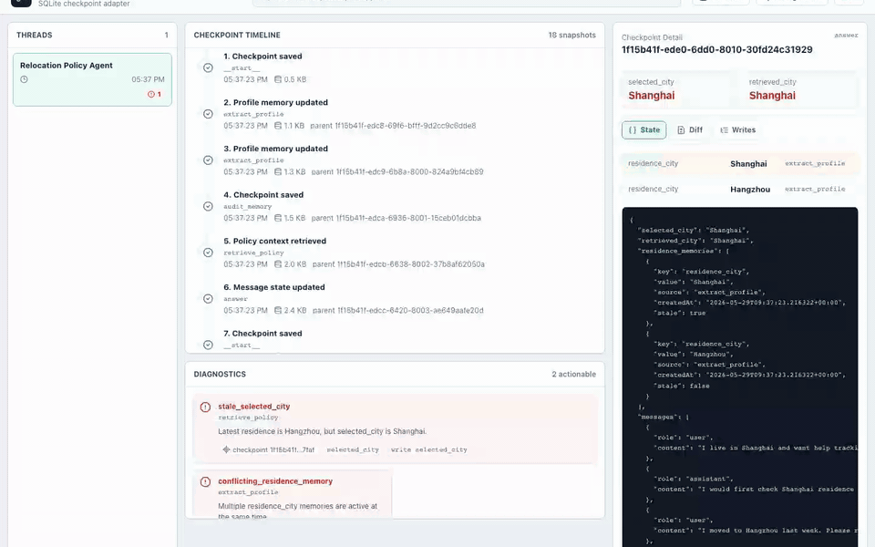

# LangGraph Memory Inspector

Local-first checkpoint forensics for LangGraph apps.

[](https://github.com/fengjikui/langgraph-memory-inspector/actions/workflows/ci.yml)

[License](LICENSE) · [Contributing](CONTRIBUTING.md) · [Fixture policy](docs/fixture_policy.md) · [Release checklist](docs/release_checklist.md) · [Community launch playbook](docs/community_launch_playbook.md)

LangGraph agents can fail long after the bad state was written. A user updates
their profile, a retriever still reads the old value, and the final answer looks
wrong even though the root cause is several checkpoints earlier.

LangGraph Memory Inspector helps developers answer:

- Which checkpoint first made the bad state visible?
- Which state channel changed?
- Which node/write should I inspect next?
- Can I debug this locally without uploading private traces?

## Demo Story

The included demo agent intentionally reproduces a stale-memory bug:

1. The user says they live in Shanghai.
2. The user later says they moved to Hangzhou.
3. The graph appends the Hangzhou memory.
4. Retrieval still selects Shanghai.
5. The final answer is grounded in the stale city.

The inspector turns that failure into a navigable evidence trail:

- timeline of saved checkpoints
- paginated timeline loading for large thread histories
- decoded state snapshots
- checkpoint-to-checkpoint diffs
- actionable diagnostics
- write-channel highlighting for the diagnostic source
- compact causal chains from a diagnostic back to related checkpoint writes
- deterministic reducer-duplicate and checkpoint-lineage diagnostics



## Quickstart

Prerequisites:

- `uv`
- Node.js and npm

Check your local setup:

```bash
uv sync
uv run lgmi doctor
```

If the doctor reports a `WARN` or `ERROR`, follow the printed next command and
run it again. This is the quickest way to verify the demo checkpoint, API reader,
Node.js/npm, and web UI dependencies before opening the app.

If you need to report a quickstart or demo startup issue, run:

```bash
uv run lgmi doctor --issue
```

Paste the generated Markdown into the GitHub issue. It includes environment and
demo health checks, but not checkpoint state, message content, prompts, tokens,
or production database rows.

Build the web UI and start the demo:

```bash
uv run lgmi demo --build-ui
```

Open `http://127.0.0.1:8765/`. `--build-ui` installs web dependencies if needed,
builds `web/dist`, and then serves the Inspector UI and API from the same local
server.

Optional API health check:

```bash
curl http://127.0.0.1:8765/api/summary
```

For frontend development, keep the API running and start Vite in terminal 2:

```bash
cd web
npm run dev
```

Open:

```text
http://127.0.0.1:5173/
```

The Vite dev server proxies `/api` to `http://127.0.0.1:8765`, so the UI reads
the live checkpoint database by default. If the API is not running, it falls
back to mock relocation-demo data.

If you want to generate checkpoint data without starting the API, run:

```bash
uv run lgmi demo --prepare-only
```

Contributors can still run the explicit demo and inspector commands:

```bash
uv run python examples/relocation_policy_agent/run_demo.py --reset
uv run lgmi inspect examples/relocation_policy_agent/data/checkpoints.sqlite --no-browser --port 8765
```

## Verify The Product Value

Run the real use-case smoke test:

```bash
uv run python scripts/use_case_smoke.py --reset-demo
```

Expected result:

```text
PASS 检查器证据链已经证明 stale memory 故障路径。
```

This test proves from checkpoint evidence that the user moved to Hangzhou while
the final retrieval still used Shanghai.

Run backend tests:

```bash
uv run pytest -q
```

Run frontend build and browser interaction tests:

```bash
cd web
npm run build
npx playwright install chromium
npm run test:e2e
```

The e2e test uses `VITE_LGMI_API_MODE=mock`, opens the inspector, clicks the
`conflicting_residence_memory` diagnostic, and verifies that the related
`state.memory_events` write is highlighted.

## Export A Debug Bundle

When you find a suspicious checkpoint, keep **Redact private fields** enabled
and click **Export redacted** in the checkpoint detail panel to create an
explicit JSON bundle that can be attached to an issue, pull request, or
teammate handoff.

You can also export the same bundle from the CLI:

```bash
uv run lgmi export-debug-bundle examples/relocation_policy_agent/data/checkpoints.sqlite \
  --thread-id relocation-demo-user-001 \
  --checkpoint-id <checkpoint-id> \
  --redact \
  --output-dir exports
```

The bundle includes:

- database summary
- thread id, checkpoint namespace, and selected checkpoint id
- timeline context around the selected checkpoint
- decoded selected checkpoint state
- incoming writes for that checkpoint
- deterministic diagnostics such as `conflicting_residence_memory`
- short reproduction notes for code review or incident debugging

The inspector never exports automatically. Files are created only after the UI
button, this CLI command, or the `POST /api/exports/debug-bundle` API action.
Generated bundles are written under `exports/`, ignored by git, and safe to
delete after you share or archive the evidence.

Redacted exports mask common private fields such as message `content`,
`evidence`, prompts, tokens, passwords, emails, and phone-like strings while
keeping structural fields such as checkpoint ids, state paths, diagnostics, and
write channels useful for debugging. The CLI also supports advanced path
controls:

```bash
uv run lgmi export-debug-bundle examples/relocation_policy_agent/data/checkpoints.sqlite \
  --thread-id relocation-demo-user-001 \
  --checkpoint-id <checkpoint-id> \
  --redact \
  --redact-path selected_checkpoint.checkpoint.value.channel_values.selected_city \
  --keep-path selected_checkpoint.checkpoint.value.channel_values.memory_events
```

Raw exports remain available with `--redaction-mode raw` or by disabling the UI
checkbox, but raw bundles may contain private checkpoint state. Do not share raw
bundles publicly without reviewing them first.

## Share A Checkpoint Pattern

Real LangGraph bugs are the best source of new diagnostics. If you can share a
pattern, follow the [fixture intake policy](docs/fixture_policy.md): prefer a
redacted debug bundle, a minimal synthetic fixture, or a schema-only backend
snapshot. Do not post raw production checkpoint stores or unredacted user state
in public issues. The [diagnostic matrix](docs/diagnostic_matrix.md) shows
which bug patterns are already protected by a demo, fixture, or test.

## Current Scope

This is an MVP focused on local checkpoint inspection:

- read LangGraph SQLite checkpoint databases
- optionally inspect LangGraph PostgresSaver stores in read-only mode
- list threads and paginated checkpoint timelines
- show and switch checkpoint namespaces per thread
- decode common state channels
- show diffs and writes
- detect stale/conflicting memory patterns
- detect reducer append duplicates, namespace confusion hints, and unexpected
  parent checkpoint jumps
- show compact diagnostic causal chains across checkpoint ranges
- export explicit debug bundles for issues and code review
- provide a React UI for local debugging

Planned next steps:

- run the Postgres adapter against more real-world checkpoint stores
- add richer node-level write attribution across multiple checkpoints
- add more redacted or synthetic checkpoint-store fixtures

## Known Limitations

- Namespace switching is per thread. Cross-namespace diffing is not supported
  because checkpoint ids can overlap across namespaces.
- Timeline pagination loads the latest page first and can load earlier
  checkpoints on demand. Very large production stores still need deeper
  indexing, virtualized rendering, and richer server-side search.
- Diagnostics are deterministic rules for known memory/debugging patterns, not
  a general correctness proof for every LangGraph application.
- Postgres support targets the full historical `PostgresSaver` schema. It does
  not target `ShallowPostgresSaver` yet.
- The inspector is local-first and read-only for checkpoint stores, but exported
  raw debug bundles can contain private state. Use redacted exports before
  sharing publicly.

## Optional Postgres Inspection

Install the optional Postgres dependencies:

```bash
uv sync --extra postgres
```

Start the inspector against a full LangGraph `PostgresSaver` schema:

```bash
lgmi inspect-postgres "$DATABASE_URL" --schema public --no-browser --port 8765
```

The Postgres reader is read-only. It does not call `setup()`, `put()`,
`put_writes()`, or `delete_thread()`. It targets the full historical
`PostgresSaver` tables: `checkpoints`, `checkpoint_blobs`, and
`checkpoint_writes`.

To run the optional integration test against your own local Postgres:

```bash
LGMI_POSTGRES_TEST_DSN="$DATABASE_URL" uv run --extra postgres pytest tests/test_postgres_reader.py -m integration
```

## Optional LLM Mode

The demo runs without an API key using deterministic local responses. To use a
real model for the answer node:

```bash
export OPENAI_API_KEY=...
uv run python examples/relocation_policy_agent/run_demo.py --use-llm
```

## Safe To Delete

These generated files can be deleted at any time:

- `examples/relocation_policy_agent/data/checkpoints.sqlite`
- `examples/relocation_policy_agent/data/checkpoints.sqlite-shm`
- `examples/relocation_policy_agent/data/checkpoints.sqlite-wal`

They are regenerated by the demo.

Generated web build and test artifacts are also disposable:

- `dist/`
- `web/dist/`
- `web/test-results/`
- `exports/`
