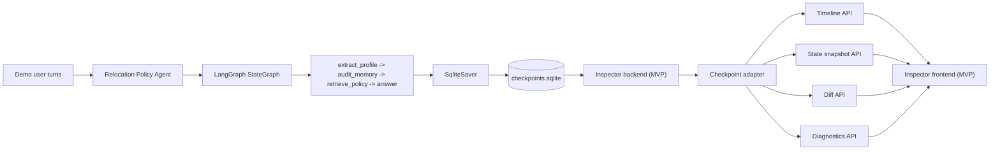
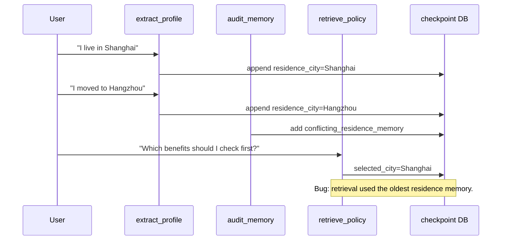

# LangGraph Memory Inspector Architecture

LangGraph Memory Inspector is a local-first debugging tool for LangGraph
applications. The project is intentionally structured around one strong demo:
a small relocation policy agent writes real LangGraph SQLite checkpoints, and
the inspector turns those checkpoints into a timeline, state diff, and memory
diagnostic story.

## System Overview



The current repository already contains the left side of the diagram: a
runnable LangGraph demo that writes checkpoint data to
`examples/relocation_policy_agent/data/checkpoints.sqlite`. The inspector
backend and frontend are the MVP target: they should read that database without
mutating it and present a developer-facing debugging workflow.

## Demo Agent

The demo agent is in `examples/relocation_policy_agent/run_demo.py`. It uses a
small `StateGraph` with this state:

- `messages`: LangChain messages accumulated with `add_messages`.
- `memory_events`: profile memory events extracted from user messages.
- `retrieved_docs`: local policy snippets selected for the answer.
- `diagnostics`: internal markers emitted by the graph.
- `selected_city`: the city used for retrieval.

The graph nodes are deliberately simple:

- `extract_profile`: reads the latest human message and appends a
  `residence_city` memory event.
- `audit_memory`: detects conflicting residence values and records
  `conflicting_residence_memory`.
- `retrieve_policy`: selects policy snippets for a city.
- `answer`: returns either a deterministic local answer or an OpenAI-backed
  answer when `--use-llm` is enabled.

The intended bug is in `retrieve_policy`: when both Shanghai and Hangzhou
residence memories exist, it selects the first remembered city instead of the
newest city. That makes the final answer use stale Shanghai context after the
user says they moved to Hangzhou.



## Checkpoint Database

The demo uses `langgraph-checkpoint-sqlite` and writes two main tables:

- `checkpoints`: state snapshots keyed by `thread_id`, `checkpoint_ns`, and
  `checkpoint_id`. Each row also stores `parent_checkpoint_id`, serialized
  checkpoint bytes, and serialized metadata.
- `writes`: per-task channel writes keyed by thread, namespace, checkpoint,
  task id, and write index.

The sample database currently follows this shape:

```text
checkpoints(thread_id, checkpoint_ns, checkpoint_id, parent_checkpoint_id,
            type, checkpoint, metadata)
writes(thread_id, checkpoint_ns, checkpoint_id, task_id, idx, channel,
       type, value)
```

The inspector should treat this database as read-only input. It should decode
serialized checkpoint payloads through a checkpoint adapter rather than by
spreading SQLite-specific logic across the application.

## Inspector Backend

The backend MVP should be a small local API server started by a command such as:

```bash
lgmi inspect examples/relocation_policy_agent/data/checkpoints.sqlite
```

Recommended backend boundaries:

- `CheckpointAdapter`: common interface for listing threads, checkpoints,
  snapshots, writes, and metadata.
- `SQLiteCheckpointAdapter`: first implementation backed by LangGraph SQLite
  saver tables.
- `PostgresCheckpointAdapter`: read-only implementation backed by
  `checkpoints`, `checkpoint_blobs`, and `checkpoint_writes`, available through
  the optional `postgres` dependency extra. See `docs/postgres_adapter_plan.md`.
- `TimelineService`: turns checkpoint rows and parent links into ordered
  execution timelines.
- `DiffService`: compares decoded state snapshots and write sets.
- `DiagnosticsService`: runs deterministic checks over checkpoints and diffs.
- `ExportService`: creates explicit debug bundles only when requested.

Current API surface:

- `GET /api/summary`
- `GET /api/threads`
- `GET /api/threads/{thread_id}/checkpoints?checkpoint_ns=...&limit=50&offset=0`
- `GET /api/threads/{thread_id}/checkpoints/{checkpoint_id}?checkpoint_ns=...`
- `GET /api/threads/{thread_id}/checkpoints/{checkpoint_id}/writes?checkpoint_ns=...`
- `GET /api/threads/{thread_id}/diff?from=...&to=...&checkpoint_ns=...`
- `POST /api/exports/debug-bundle`

`GET /api/threads` includes `checkpoint_namespaces` per thread. When
`checkpoint_ns` is provided, timeline, checkpoint, writes, diff, and debug
bundle export are scoped to that namespace. Timeline responses use a paginated
contract: `{ items, pagination, filters }`. The API supports `limit`, `offset`,
`from_end`, `diagnostic`, and `changed_path`; the UI uses `from_end=true` for
the first page so large production threads open on the most recent evidence
without loading the full history.

`POST /api/exports/debug-bundle` is an explicit user action. It writes a JSON
artifact under `exports/` with database summary, thread/checkpoint metadata,
timeline context, selected checkpoint state, incoming writes, diagnostics, and
reproduction notes. The request accepts `redaction_mode`, `redact_paths`, and
`keep_paths`; the response returns the generated path, file size, redaction
mode, and redacted paths so the UI can make the artifact visible instead of
silently writing files.

The backend should never require an OpenAI key to inspect checkpoints. Optional
LLM features can be layered later, but the MVP diagnostic path should remain
deterministic and reproducible.

## Inspector Frontend

The frontend MVP should make one debugging path obvious:

1. Choose a local checkpoint database.
2. Select a thread, such as `relocation-demo-user-001`.
3. See a checkpoint timeline with node/write hints.
4. Open a state snapshot.
5. Compare two checkpoints.
6. See diagnostics that explain the stale memory failure.

Recommended views:

- Database summary: file path, table counts, checkpoint count, write count, and
  file size.
- Thread list: thread id, namespace, checkpoint count, first checkpoint, last
  checkpoint.
- Namespace selector: active namespace and deliberate switching when a thread
  contains more than one checkpoint namespace.
- Timeline: checkpoint order, parent relationship, task/write attribution, and
  size deltas.
- State inspector: decoded JSON tree with channels such as `memory_events`,
  `retrieved_docs`, `diagnostics`, and `selected_city`.
- Diff viewer: added, removed, and changed state fields between two selected
  checkpoints.
- Diagnostics panel: named issues with severity, evidence, and recommended
  next debugging step.

## Diff And Diagnostics

The first diagnostic engine can be rule-based. It should prefer precise,
explainable findings over broad guesses.

Core checks:

- `conflicting_residence_memory`: more than one distinct value exists for
  `memory_events[type=residence_city]`.
- `stale_retrieval_context`: `selected_city` does not match the newest
  residence memory.
- `checkpoint_size_spike`: serialized checkpoint size increases beyond a
  configurable threshold.
- `oversized_message_history`: message count or serialized message payload size
  crosses a threshold.
- `missing_parent_checkpoint`: a checkpoint references a parent id that is not
  present for the same thread and namespace.

For each finding, the inspector should show:

- issue id and severity
- checkpoint id where the issue is first visible
- relevant state path, such as `memory_events[1].value`
- likely writer when write metadata is available
- short explanation and reproduction note

## Storage Hygiene

Generated checkpoint files are disposable demo artifacts:

- `examples/relocation_policy_agent/data/checkpoints.sqlite`
- `examples/relocation_policy_agent/data/checkpoints.sqlite-shm`
- `examples/relocation_policy_agent/data/checkpoints.sqlite-wal`

They are safe to delete and are regenerated by the demo. They should not be
committed as source artifacts.

Inspector exports are also generated artifacts. The MVP should create them only
after an explicit user action, display their file size, and document that they
can be safely deleted after the interview/demo/debugging session. SQLite
checkpoint databases, WAL/SHM sidecars, debug bundles, and UI export files
should stay out of commits unless a deliberately tiny fixture is added for
tests.
